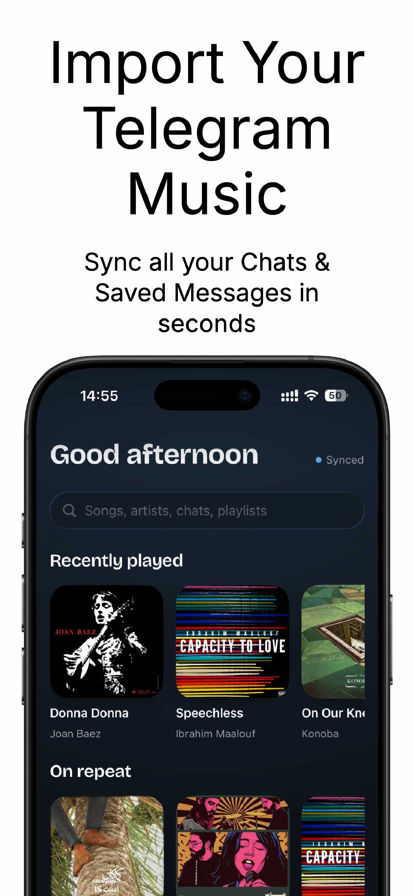
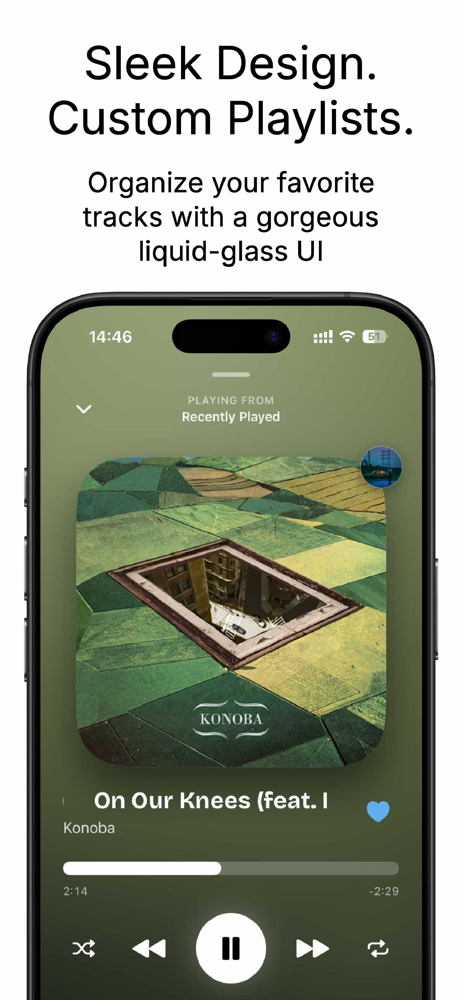
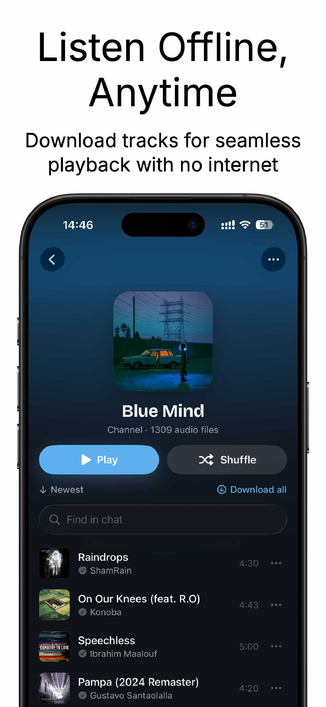

# GramMusic

**Your Telegram music, organized into a music library.**

[](https://apps.apple.com/us/app/grammusic/id6804196304)
[](https://t.me/GramMusicApp)

Follow [@GramMusicApp](https://t.me/GramMusicApp) for GramMusic news and release updates.

GramMusic is a native iPhone music player for audio accessible through your own Telegram
account: channels, groups, personal chats, Saved Messages, and profile music. Import the
sources you want, build playlists, and listen with a dedicated player instead of hunting
through chat messages.

Built with SwiftUI, SwiftData, AVFoundation, and Telegram’s official TDLib through
[TDLibKit](https://github.com/Swiftgram/TDLibKit). Supports iOS 17 and later.
GramMusic is independent and is not affiliated with Telegram or Apple.

**Open source under GNU GPL version 2 or later (`GPL-2.0-or-later`).** You may use,
modify, and redistribute GramMusic, including commercially, under the license terms.
When distributing a covered build, provide its corresponding source under the GPL and
retain the required notices. Private changes do not have to be published. See [LICENSE](LICENSE)
and [licensing details](docs/development.md#license-and-contributions).

## Features

- **Create your own playlists:** collect songs from Telegram chats and search results,
  organize them into playlists, and manage their contents.
- **Follow artists:** keep artists in your Library and open a dedicated artist page that
  brings together their music found across your Telegram chats.
- **A unified library:** imported Telegram chats, profile playlists, favorites, downloads,
  pinning, sorting, and recent listening.
- **Music search:** a dedicated Search page and shortcuts on Home and Library; local
  collection search; optional user-connected inline music bots with custom names and
  query prefixes, automatic bot pagination, and bounded retries.
- **An optional Search playlist:** saves search-origin songs you actually listen to,
  rather than every returned result. Disabled by default; supports clearing its contents.
- **Playback built for music:** background audio, Lock Screen and Control Center controls,
  a play queue, repeat, shuffle, resume, and progressive shuffle for large chats.
- **Offline listening:** explicit downloads, a bounded playback cache, download management,
  and a compact connection notice. Playback takes priority over bulk downloads.
- **Lyrics:** a preview card below the player and a full lyrics view; synchronized lyric
  highlighting and seeking, plain lyrics, and embedded-file fallback.
- **Library controls:** compact bulk selection, playlist additions/removals, reversible
  chat-song hiding, and direct navigation from player source icons.
- **Sound and sharing:** a five-band equalizer with presets, artwork, music share cards,
  lyrics snippets, and supported story/video sharing.
- **Adaptive iOS UI:** native tabs and mini-player on iOS 26.1+, compatible docks on older
  supported versions, Dynamic Type support, and Recently Played widgets.

[Version 1.1.0 release notes](docs/release-notes-1.1.0.md).

## Screenshots

| Telegram music library | Music player | Offline listening |
| --- | --- | --- |
|  |  |  |

## Build your own copy

### Requirements

- macOS and Xcode **26.2 or later** with an iOS Simulator runtime. Xcode 26.2 is the
  verified toolchain; the deployment target remains iOS 17.
- [XcodeGen](https://github.com/yonaskolb/XcodeGen): `brew install xcodegen`.
- Internet access for the initial Swift package downloads, including the large TDLib
  binary package. Firebase dependencies are resolved even when analytics is unconfigured.
- Your own Telegram API ID and hash for real Telegram access, from
  [my.telegram.org/apps](https://my.telegram.org/apps). These are client-app credentials,
  distinct from a BotFather bot token.

### Setup

```sh
git clone https://github.com/TheMalenia/grammusic-ios.git
cd grammusic-ios
cp Config/Secrets.example.xcconfig Config/Secrets.xcconfig
# Edit Config/Secrets.xcconfig with your own Telegram API ID and hash.
xcodegen generate
open GramMusic.xcodeproj
```

Choose the **GramMusic** scheme and an iPhone simulator, then Run (⌘R).
`project.yml` is the source of truth; regenerate after adding/removing Swift files or
changing project configuration.

The native app uses **xcconfig**, not `.env`. The existing
[Secrets.example.xcconfig](Config/Secrets.example.xcconfig) is the configuration template.
Do not put real credentials into that example or commit `Secrets.xcconfig`.

### Explore without Telegram credentials

Keep the template’s placeholder values, generate the project, and enter the demo phone
number **+1 555 0100** with any verification code. Demo mode uses mock data and bundled
sample audio; it does not connect to a real Telegram account. Alternatively set
`AppConfig.useMockTelegram = true` for development with mock data throughout.
The normal source defaults to the real Telegram backend. Demo mode still requires the
package downloads needed to build; it is not a package-free build.

### Install on your iPhone

Use your own Apple development team and distinct app/widget bundle identifiers in
`project.yml`, regenerate, and configure signing for both targets in Xcode. Do not use
the maintainers’ provisioning profiles. Local project signing changes may be overwritten
by regeneration. If you distribute a build, comply with the GPL and the distribution
platform's requirements.

For cross-process widgets, create your own App Group, enable it for the app and widget
entitlements, and update `WidgetSharedStore.appGroupId` to the same identifier. The
checked-in entitlements do not provision a shared App Group for your Apple account.

### Firebase is optional

A personal build runs without Firebase configuration. Analytics calls do nothing when
Firebase is unconfigured. To enable it, create **your own** Firebase iOS app, download its
`GoogleService-Info.plist`, place it in `GramMusic/`, and regenerate the project. The file
is ignored by Git. Do not reuse the maintainers’ Firebase project or upload service-account
keys. [Configuration details](Config/README.md).

### Build and test from the terminal

```sh
xcodebuild -project GramMusic.xcodeproj -scheme GramMusic \
  -destination 'generic/platform=iOS Simulator' CODE_SIGNING_ALLOWED=NO build

# Substitute an installed simulator name if yours differs.
xcodebuild -project GramMusic.xcodeproj -scheme GramMusic \
  -destination 'platform=iOS Simulator,name=iPhone 17' \
  -only-testing:GramMusicTests CODE_SIGNING_ALLOWED=NO test
```

The October 9, 2026 public-source verification passed all 367 unit tests and the
app-launch UI smoke test using placeholder Telegram credentials and no Firebase config.
See [verification and limits](docs/development.md#last-verified-build--october-9-2026)
and the [manual testing checklist](docs/music-search.md).
Mock/hosted tests do not verify live bot responses or real-device performance.

## Inline music bots

An **inline bot** is a Telegram bot that responds to a query such as
`@your_music_bot song title` with selectable results inside another chat. Some bots return
playable audio; others return text, images, or links. GramMusic shows accessible audio
results as songs and uses the selected bot as a search source. It does not send a result
to a chat merely to play it. Queries go only to the selected source.

### Connect an existing bot

1. Open **Settings → Search → Search sources → Connect a bot**.
2. Enter its username. Telegram must confirm that it supports inline mode.
3. Optionally choose a display name and a fixed query prefix, then connect it.
4. Choose the source in Search. You can set a default source in search settings.

A bot token is **not needed** to connect someone’s inline bot. Some bots require prior
setup or membership; GramMusic cannot bypass that. Returned media must be audio or a
recognized audio document. [Search setup and behavior](docs/music-search.md).

### Create your own inline bot

1. Create a bot through [@BotFather](https://t.me/BotFather) using `/newbot`.
2. Enable inline mode using `/setinline` and choose a placeholder.
3. Run a backend that receives `inline_query` updates and returns audio results through
   [`answerInlineQuery`](https://core.telegram.org/bots/api#answerinlinequery), such as
   [`InlineQueryResultAudio`](https://core.telegram.org/bots/api#inlinequeryresultaudio) or
   cached audio results. Creating a BotFather account alone does not implement search.
4. Keep the bot token on your backend, use media you are authorized to provide, and
   connect the bot’s username in GramMusic.

Official references: [Inline bots](https://core.telegram.org/bots/inline),
[bot tutorial](https://core.telegram.org/bots/tutorial), and
[Bot API](https://core.telegram.org/bots/api). Bot hosting is separate from this iOS app.

## Project map

| Path | Purpose |
| --- | --- |
| `GramMusic/Nocturne/` | SwiftUI screens, components, player, and navigation |
| `GramMusic/Services/` | Telegram backend, search, playback, downloads, lyrics, and caching |
| `GramMusic/Persistence/` | SwiftData playlists and track references |
| `GramMusic/Models/` | Shared music, search, and widget models |
| `GramMusicWidgets/` | Recently Played widgets |
| `GramMusicTests/` | Unit and hosted layout/navigation tests |
| `project.yml` | XcodeGen project and dependency configuration |
| `Config/` | Placeholder configuration and local setup documentation |

## Documentation and permissions

- [Development guide](docs/development.md)
- [Search guide](docs/music-search.md)
- [Privacy policy](docs/privacy-policy.md)
- [TestFlight checklist](docs/testflight-notes.md)
- [Demo audio attribution](GramMusic/Resources/DemoAudio/CREDITS.md)

Telegram credentials, sessions, personal data, Firebase configuration, and signing keys
must stay outside the public source. Metadata lookup sends track title/artist information
to iTunes or LRCLIB; the privacy policy explains the details. Access to Telegram content
does not grant redistribution rights to the music. Third-party packages and demo media
retain their own licenses; the GPL does not replace their notices or license terms.

For bugs, provide reproduction steps and remove account identifiers, tokens, and private
chat information from logs. Contact **grammusic@proton.me** for security reports or
licensing questions.
